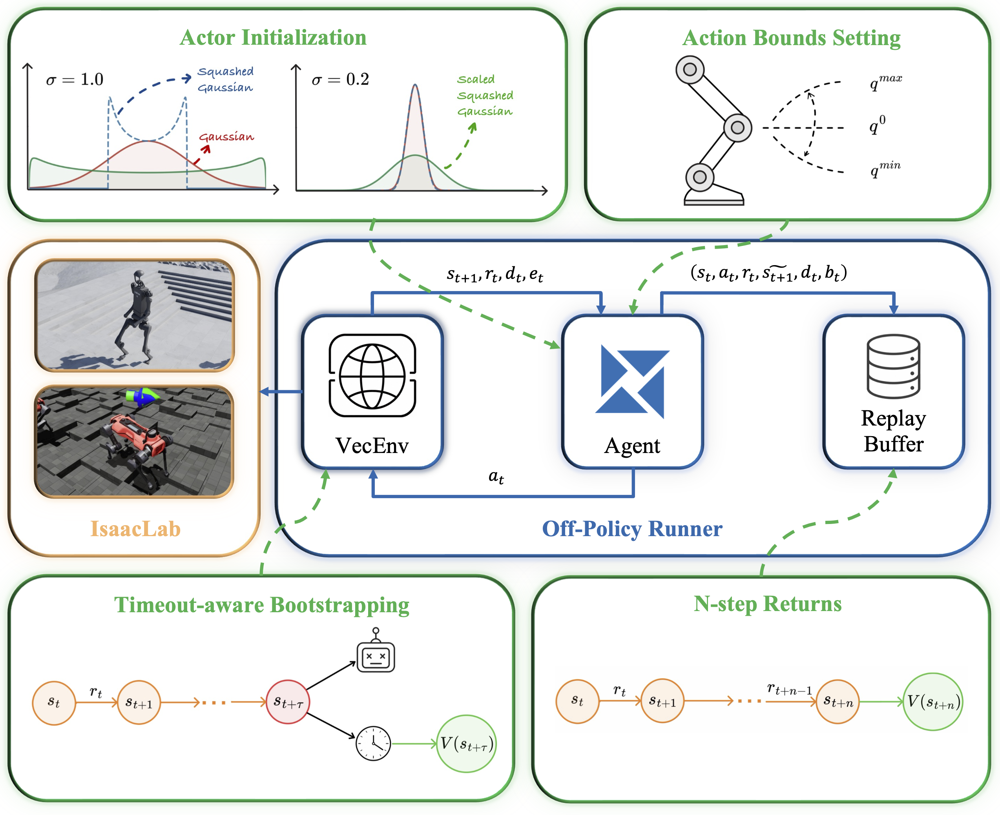

# RSL-RL-SAC

<p align="center">
  
</p>

This is a fork of [rsl_rl](https://github.com/leggedrobotics/rsl_rl) extended with **Soft Actor-Critic (SAC)** support, released alongside:

**"Bridging the Gap: Enabling Soft Actor Critic for High Performance Legged Locomotion"**
Sabatini, Li, Hutter — ETH Zurich

| Resource | Link |
|---|---|
| Paper (arXiv) | https://arxiv.org/abs/2605.24975 |
| Project Page | https://sabagian.github.io/sac_release_project/ |
| Companion IsaacLab fork | https://github.com/sabagian/isaaclab-sac |

## Installation

Clone this repository and install it with:

```bash
git clone https://github.com/leggedrobotics/rsl_rl_sac
cd rsl_rl_sac
pip install -e .
```

For the full setup, follow these instructions alongside those in the [companion IsaacLab fork](https://github.com/sabagian/isaaclab-sac), and make sure `isaaclab` and `rsl_rl_sac` share the same parent directory, as the IsaacLab Docker container expects. Only a single commit in our IsaacLab fork is functionally relevant to this work (the others are documentation changes), so you can either install the fork directly or cherry-pick that one commit into your existing installation.

## Citing

If you use this work, please cite:

```bibtex
@misc{sabatini2026bridginggapenablingsoft,
  title={Bridging the Gap: Enabling Soft Actor Critic for High Performance Legged Locomotion},
  author={Gianluca Sabatini and Chenhao Li and Marco Hutter},
  year={2026},
  eprint={2605.24975},
  archivePrefix={arXiv},
  primaryClass={cs.RO},
  url={https://arxiv.org/abs/2605.24975},
}
```
